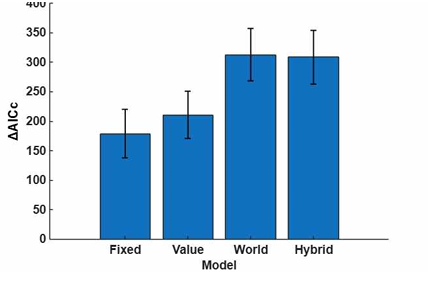

# Bayesian Decision Modeling

This repository presents a Bayesian decision-making framework, including theoretical derivation, model fitting, and model evaluation using MATLAB.

---

## 📐 Bayesian Inference

We assume:

$$
p(S) = \mathcal{N}(\mu, \sigma^2), \quad p(x|S) = \mathcal{N}(S, \sigma_0^2)
$$

Using Bayes’ rule:

$$
p(S|x) \propto p(x|S)p(S)
$$

Combining the exponents and completing the square:

$$
p(S|x) = \mathcal{N}(\mu_p, \sigma_p^2)
$$

where

$$
\sigma_p^2 = \left( \frac{1}{\sigma^2} + \frac{1}{\sigma_0^2} \right)^{-1}
$$

$$
\mu_p = \sigma_p^2 \left( \frac{\mu}{\sigma^2} + \frac{x}{\sigma_0^2} \right)
$$

---

## ⚙️ Model Fitting

Model parameters (sensory noise, bias, and lapse rate) were estimated using Maximum Likelihood Estimation (MLE).

The fitting procedure was implemented by modifying an existing decision model framework provided during a research internship.

The likelihood was computed using a simulation-based approach, and parameters were optimized using Bayesian Adaptive Direct Search (BADS).

Due to the use of proprietary lab code, the full implementation is not included.

---

## 📊 Model Evaluation

The predictive performance of candidate models was evaluated using AICc.

The AICc values were computed from negative log-likelihood values across models.

---

## 📂 Contents
- `model_evaluation_aicc.m`: Computes AICc values  
- `evaluate_models.m`: AICc calculation function  

---

## 📝 Notes
This project was completed as part of a research internship.

Original datasets and proprietary materials are not included.
